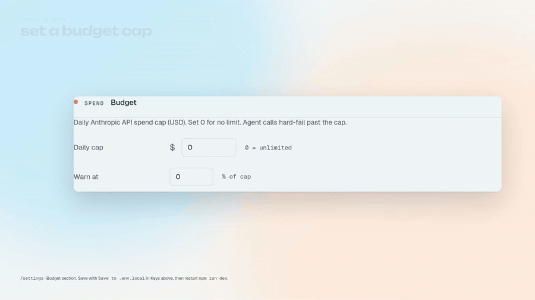
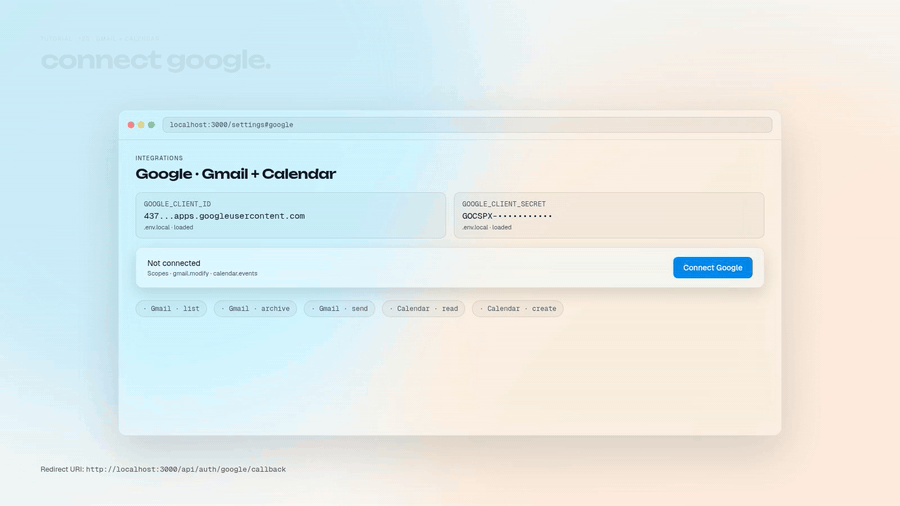
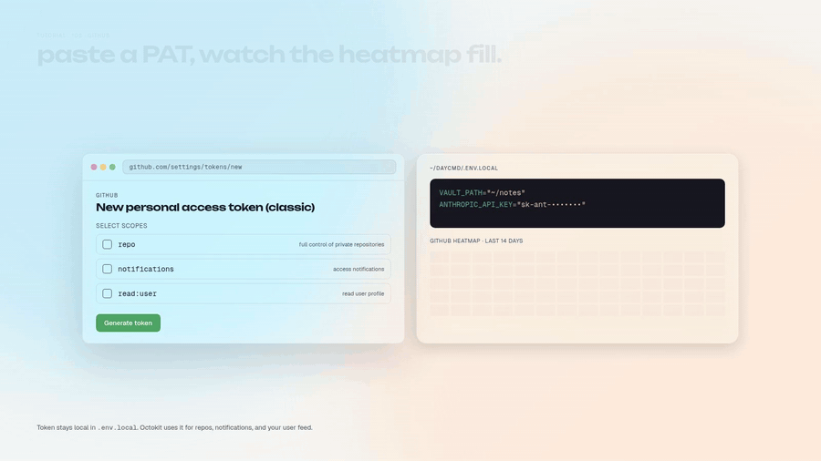
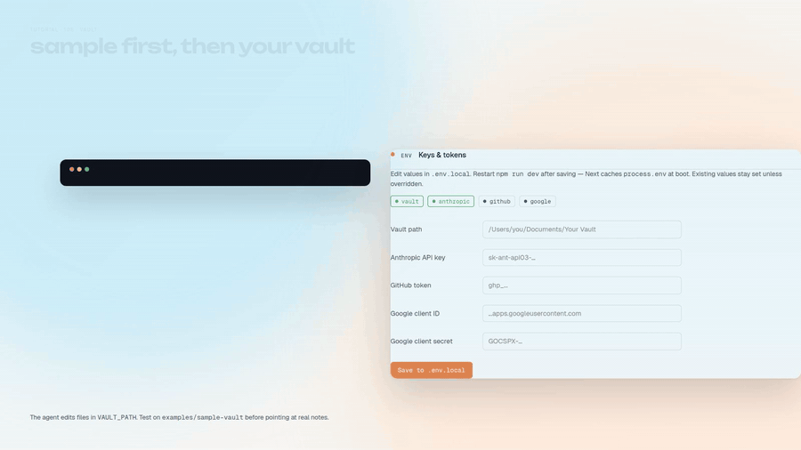
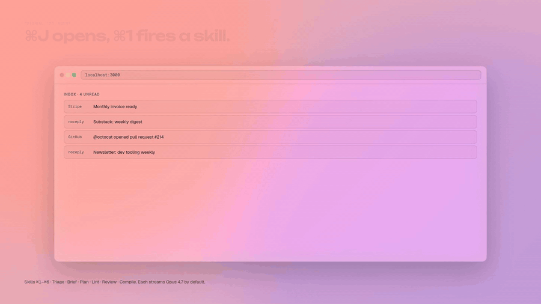
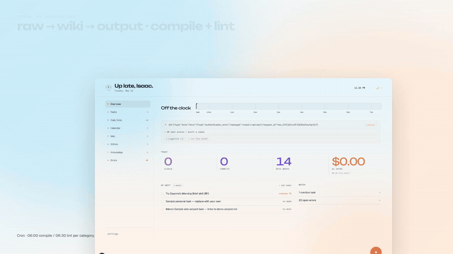

# Tutorials

Short walkthroughs of the parts of daycmd that are easy to misconfigure or miss. Each clip is silent, ~8–14 seconds, and pairs **real screenshots** of the running app with animated callouts. The screenshots come from `npm run video:shots` against a live dev server; the Remotion compositions in [`remotion/tutorials/`](../remotion/tutorials/) layer highlights and explanations on top.

Regenerate:

```bash
npm run dev                 # in one terminal, with VAULT_PATH set
npm run video:shots         # capture PNGs into remotion/shots/
npm run video:tutorials     # render GIFs into docs/tutorials/
```

---

## 1. Set a budget cap — before you run a skill

The Budget section of `/settings` lets you cap daily Anthropic spend. Default is **`$0`** which means **unlimited** — a few `Triage Inbox` runs in a row could quietly burn real money. Set a number, hit `Save to .env.local` (in the Keys section above), restart `npm run dev`.



---

## 2. Connect Google — Gmail + Calendar

The Integrations section stays **"not configured"** until you add `GOOGLE_CLIENT_ID` + `GOOGLE_CLIENT_SECRET` to `.env.local` and restart. After that a **Connect Google** button appears; clicking it does the OAuth redirect (callback at `http://localhost:3000/api/auth/google/callback`).



---

## 3. GitHub PAT — three scopes, one paste

Generate a classic PAT at <https://github.com/settings/tokens/new> with **`repo`**, **`notifications`**, **`read:user`**. Drop it into the GitHub token field, save, restart. The pill dot next to "github" fills once the value loads at boot.



---

## 4. Sample vault first, then swap to yours

`VAULT_PATH` decides where the agent reads + writes. Point it at the bundled `examples/sample-vault` for the first session — the agent will edit those files freely without touching your real notes. Once you trust the behavior, edit `.env.local` (or use the Vault path field in `/settings`) and restart.



---

## 5. The agent dock — ⌘J opens, ⌘1–⌘6 fire skills

The orange dock button in the bottom-right (or `⌘J`) expands the agent panel. The six skills mapped to `⌘1`–`⌘6` are **Morning Brief · Triage Inbox · Plan Today · Research Topic · Stale Tasks · Daily Reflection**. Each streams Opus 4.7 by default; per-skill model overrides live in `/settings`.



---

## 6. Knowledge base — raw → wiki → output

The Knowledge view (left nav) lists every category with its wiki page count and a `run` action. `run` compiles all `raw/` agent logs into `wiki/` pages, then lints — drift in wiki references surfaces in `/errors` and mirrors to `Errors/{date}.md` in your vault. Default cron: compile at 06:00, lint at 06:30.



---

## Regenerating

Each tutorial = one Remotion `<Composition>` in [`remotion/Root.tsx`](../remotion/Root.tsx) backed by a component in [`remotion/tutorials/`](../remotion/tutorials/). Shared primitives (`ShotFrame`, `Shot`, `HighlightBox`, `Callout`, `Keychord`, `TerminalStrip`) live in [`tutorials/ShotFrame.tsx`](../remotion/tutorials/ShotFrame.tsx).

If you change the UI and the shots get stale, re-run the two scripts above. If the highlight rings drift, the rect coordinates at the top of each tutorial file are in raw screenshot pixels — adjust those, not the screenshots themselves.
